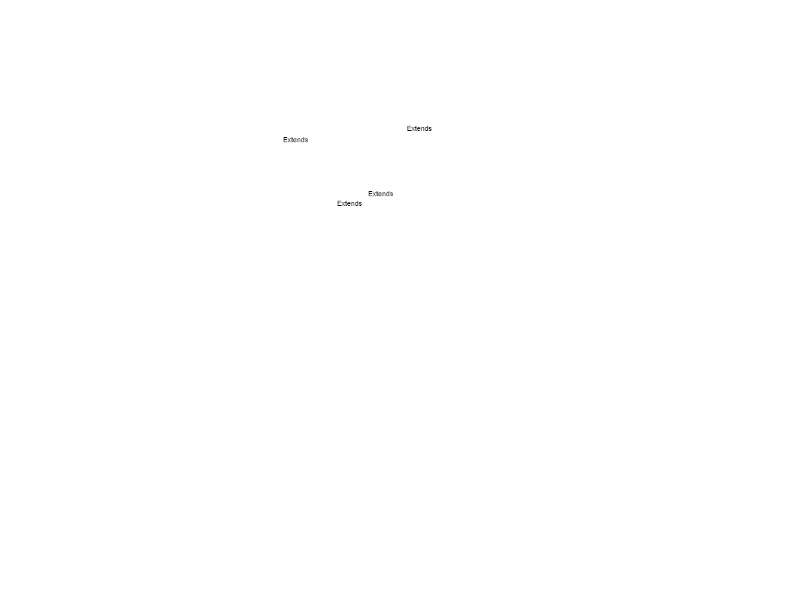

# Book My Show / Movie Ticket Booking :

## Requirements :

1. List cities where cinemas are located.

2. Each cinema can have multiple halls and each hall will run one show at a time.

3. Each movie will have multiple shows.

4. Each cinema hall runs only one movie at a time.

5. Customers can search movies based on title, genre, language, release date, and city name.

6. Customers can select show and book tickets.

7. The system will show seating arrangements in the hall and Customers can select their own seats based on their preferences.

8. Customers can pay for tickets and cancel their tickets.

9. The system can send notifications whenever there is a new movie, or when a booking is made or canceled.

10. Customers of our system should be able to pay with credit cards or cash.

11. The system should ensure that no two customers can reserve the same seat.

12. Admin can add a new movie, cancel the movie.

## Use Case Diagram :

## Activity Diagram :

## Class Diagram :
