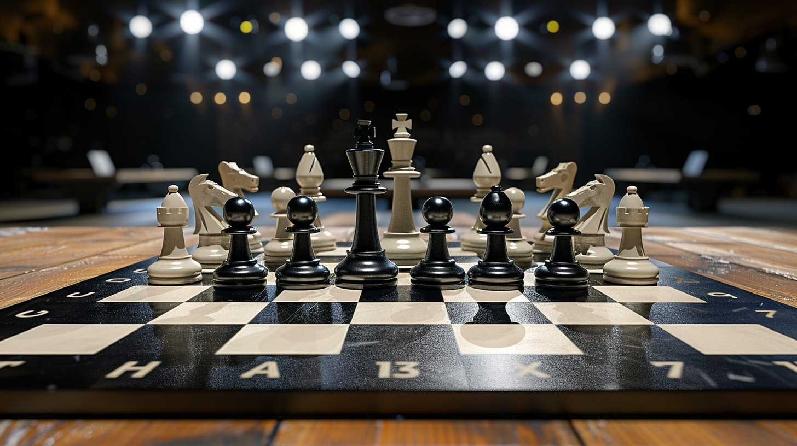

# Design Chess Game

> Chess is a strategic board game for two players, played on a chessboard with 64 squares arranged in an 8×8 grid. While there are several variations of the game played globally, this design problem will focus on creating an online two-player chess game.

## Requirements :

## Use Case Diagram :

## Activity Diagram :

## Class Diagram :

## Resources :

