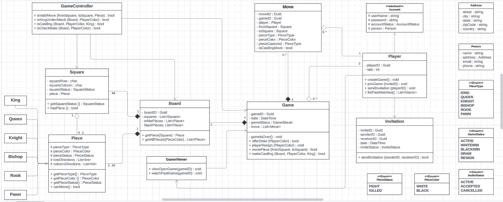

# Design Chess Game

> Chess is a strategic board game for two players, played on a chessboard with 64 squares arranged in an 8×8 grid. While there are several variations of the game played globally, this design problem will focus on creating an online two-player chess game.

## Requirements :

1. The system should support two online players to play a game of chess.

2. A player can send challenge invitation to other player.

3. All rules of international chess will be followed.

4. Each player will be randomly assigned a side, black or white.

5. Both players will play their moves one after the other, the white side plays the first move.

6. Players can’t cancel or roll back their moves.

7. The system should maintain a log of all moves by both players.

8. Each side will start with 8 pawns, 2 rooks, 2 bishops, 2 knights, 1 queen, and 1 king.

9. The game can finish either in a checkmate from one side, forfeit or stalemate (a draw), or resignation.

## Use Case Diagram :

## Activity Diagram :

## Class Diagram :

## Resources :

