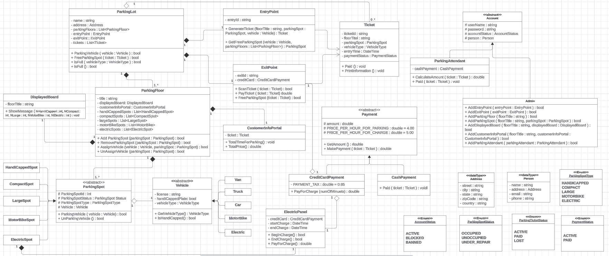

## Requirements :

1. The parking lot should have multiple floors.

2. The parking lot should have multiple entry and exit points and support concurrent access.

3. Customers can collect a parking ticket from the entry points and can pay the parking fee at the exit points on their way out.

4. Customers can pay via both cash and credit cards.

5. Customers should also be able to pay the parking fee at the customer’s info portal on each floor. If the customer has paid at the info portal, they don’t have to pay at the exit.

6. The system should not allow more vehicles than the maximum capacity of the parking lot. If the parking is full, the system should be able to show a message at the entrance panel and on the parking display board on the ground floor.

7. Each parking floor will have many parking spots. The system should support multiple types of parking spots such as Compact, Large, Handicapped, Motorcycle, etc.

8. The Parking lot should have some parking spots specified for electric cars. These spots should have an electric panel through which customers can pay and charge their vehicles.

9. The system should support parking for different types of vehicles like car, truck, van, motorcycle, etc

10. Each parking floor should have a display board showing any free parking spot for each spot type.

## Use Case Diagram :

## Activity Diagram :

## Class Diagram :

## Resources :

* [Design Parking Lot | Object Oriented System Design Question | Amazon Interview Question](https://www.youtube.com/watch?v=nwioCA5nrYc)

* [Parking Lot Design | Grokking The Object Oriented Design Interview Question](https://www.youtube.com/watch?v=tVRyb4HaHgw&t=710s)
